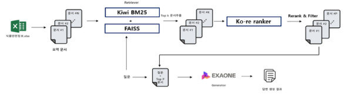

# 💊🍽️ Food Safety RAG-QA
### RAG 기반 식품 안전 질의응답 시스템

[2025 식품의약품안전처 협력 프로젝트]  
기간: 2025.01 ~ 2025.12  

Crawling → Retrieval → Re-ranking → QA Generation (End-to-End)

## Overview

본 프로젝트는 **식품의약품안전처(MFDS)**의 방대한 공개 문서와 규제 자료를 기반으로, 
요약, 대분류, 소분류, QA 시스템 총 4가지 task를 수행

본 레포지토리는 전체 프로젝트 중 **크롤링 및 QA 파이프라인 구현 영역**을 다룸

현업 담당자가 **신속하고 정확하게 질의응답을 수행할 수 있도록 지원하는 RAG(Retrieval-Augmented Generation) 기반 QA 시스템**을 구축하는 것을 목표


=>  식약처 공개 문서를 수집 및 정제하고
**하이브리드 검색(BM25 + Dense Embedding) + 한국어 리랭커 + LLM 응답기**를 결합하여 실제 현업에서 문서 검토를 지원할 수 있는 QA 시스템을 구현하는 것을 목표


## Motivation

### 식품 안전 문서 환경의 한계

- 법령, 고시, 가이드라인 등 **문서 수량 과다**
- PDF, HTML, 표, 이미지 등 **비정형 데이터 혼재**
- 특정 질의에 대해 **수작업 문서 검토 필요**

### 문제 인식

- 단순 키워드 검색은 문맥 기반 질의에 취약
- 유사 문서 다수로 인해 **정확한 근거 파악 어려움**
- 현업에서 바로 활용 가능한 **QA 형태의 응답 필요**


## Proposed Pipeline


```
Web Documents
↓
Asynchronous Crawling (Playwright)
↓
Content Extraction & Cleaning (CETD)
↓
Hybrid Retrieval (BM25 + LaBSE)
↓
Korean Re-ranking (Ko-Reranker)
↓
QA Pair Generation (GPT + Gemini)
↓
Answer Generation (Exaone / GPT)
```

## System Architecture

### Input
- 사용자 자연어 질의 (한국어)

### Output
- 질의에 대한 자연어 답변
- 근거 문서 출처 포함

## Data Collection

- **Crawling Method**
  - Playwright 기반 비동기 크롤러
- **Source**
  - 식약처 제공 웹페이지 및 포털
- **Scale**
  - 약 30,000건 이상의 문서 수집

## Preprocessing

- **CETD (Content Extraction via Tag Density)**
  - HTML 기반 본문 추출
- 표 / 이미지 캡션 후처리
- 불필요한 네비게이션·광고 영역 제거

---

## Retrieval Module

### Hybrid Search

- **BM25**
  - 키워드 기반 검색
- **LaBSE**
  - 의미 기반 Dense Embedding
- 두 결과를 결합한 하이브리드 검색 구조
- 가중치 조정 가능

## Re-ranking

- **Ko-Reranker 적용**
- 상위 검색 결과에 대해
  - 문맥 기반 정밀 재정렬 수행
- 한국어 질의–문서 정합성 개선

## Answer Generation

- **LLM**
  - Exaone / GPT API
- Retrieval 결과를 context로 활용한
  **근거 기반 답변 생성**
- 모든 응답에 **출처 문서 인용 포함**

## System Characteristics

- End-to-End 자동화 파이프라인
- 하이브리드 검색 + 리랭킹 구조
- 한국어 특화 QA 시스템
- 온프레미스 환경 실행 가능
- 내부망 환경에서도 활용 가능


##  담당 역할  

- Playwright 크롤러 구현  
- BM25 + Dense 기반 하이브리드 검색기 및 Ko-Reranker 설계  
- QA 데이터 생성 및 교차 검증 파이프라인 구축  
- Hit@K, F1, METEOR 기반 검색/생성 품질 평가 수행  
